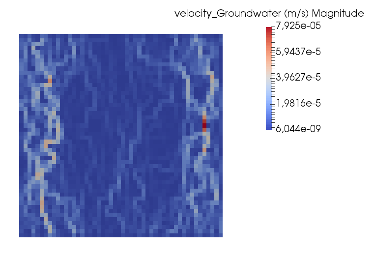

This tutorial was copied from dumux/test/porousmediumflow/tracer/1ptracer.

# One-phase flow with with random permeability distribution and a tracer model

## Problem set-up
A contaminant tracer is diluted by diffusion and a base groundwater flow from the bottom to the top. The permeability within the domain is randomly distributed.

## Tracer model
This example combines a stationary One-phase flow problem with a tracer model. In the first step, the groundwater-velocity is evaluated under stationary conditions. Based on the volume fluxes, the tracer model is solved instationary.
### main.cc

Both, the problem_1p.hh and the problem_tracer.hh have to be included in the main file.

```C++
#include "problem_1p.hh"
#include "problem_tracer.hh"
```
In lines 83-192, the stationary 1p problem is setup and soved and the volume fluxes are calculated for the tracer problem.
In lines 193-292, the tracer problem is set up on the same grid and solved instationary.

### problem_tracer.hh
The molar mass of the component and the binary diffusion coefficient can modified in lines 117-128.

### spatialparams_tracer.hh
The density, the molar mass of the fluid as well as the prosity and dispersivity can be adapted in the lines 63-93.

## Random permeability generation
### spatialparams_1p.hh
The follwing code can be found in lines 64-72.

```C++
// generate random fields
        std::mt19937 rand(0);
        std::lognormal_distribution<Scalar> K(std::log(permeability_), std::log(permeability_)*0.1);
        std::lognormal_distribution<Scalar> KLens(std::log(permeabilityLens_), std::log(permeabilityLens_)*0.1);
        for (const auto& element : elements(fvGridGeometry->gridView()))
        {
            const auto eIdx = fvGridGeometry->elementMapper().index(element);
            const auto globalPos = element.geometry().center();
            K_[eIdx] = isInLens_(globalPos) ? KLens(rand) : K(rand);
        }
```
Two lognormal distributions are defined: K and KLens with different means and standard deviations. In this case the mean is defined as the log of the permeability given from the input file and the standard deviation is 10% of the mean.
Within a loop through all elements the randomly generated permeabilities are assigned according to their position in the domain (inside or outside the lense).
### params.input
The two mean values of the permeability are specified in the params.input file.
```C++
Permeability = 1e-10 # [m^2]
PermeabilityLens = 1e-11 # [m^2]
```
## Results
The random permeability distribution generates the velocity profile shown in the left plot. The image in the middle illustrates the tracer distribution after 2500s and the image on the right after 5000s.

| |  | |
|:---:|:---:|:---:|
| velocity profile| tracer concentration after 2500s | tracer concentration after 5000s |
